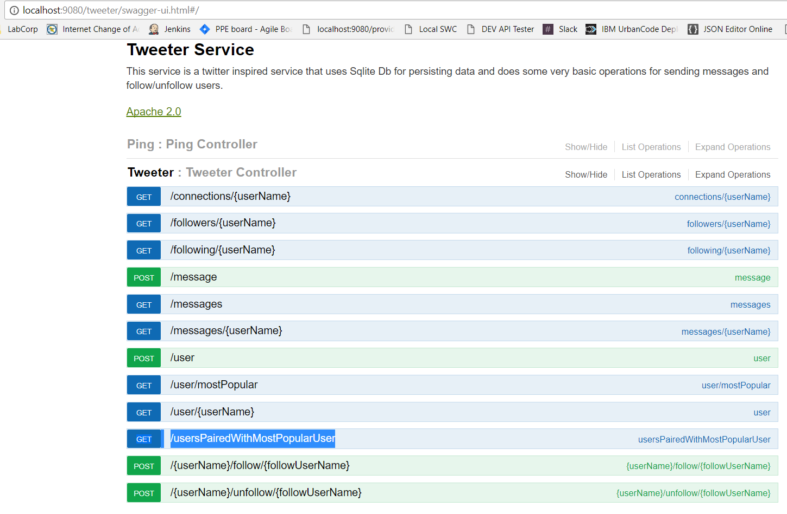
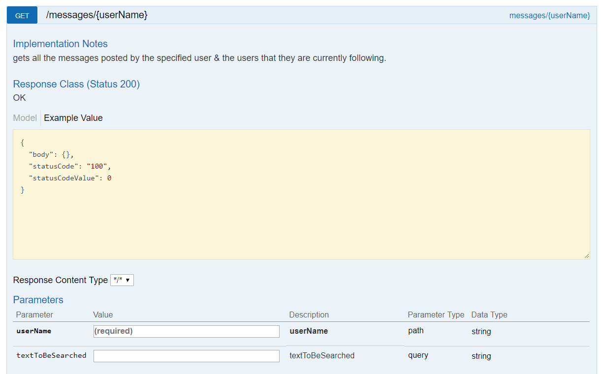
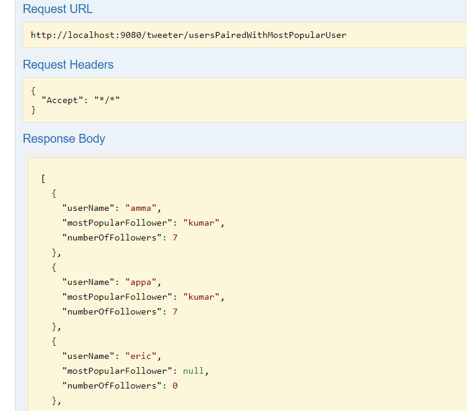

## Overview

This is a twitter inspired service that covers some basic operations like posting messages, following users, getting connections, searching the messages with a keyword for a particular user.
I have implemented `SWAGGER.io` for the detailed documentation for this service. The URL to access swagger-ui is `http://localhost:<port>/tweeter/swagger-ui.html`.
I have implemented `HTTP BASIC` authentication for the service. Hence you will be asked to authenticate while loading the swagger-ui.html.
I have implemented logback async way of logging the service activities as well.

`NOTE: as of now implemented Arraylist, however if necessary and there is a valid reason, we can use map interface to avoid iterations while looking up for an specific item in the list. 
For example: for the call that gets usersPAiredWithMostPopularfollower. we can use map, so that its easy to look for and get the info for a specific user.`

screenshot of a swagger-ui.html for this service is shared below for reference.

## Pre-requisite

Please make sure to have the JVM variable `-Dcom.tweeter.app.env=local`.

## Ping

This is just for easy way to check if the service is up and running fine in a any environment. This can be achieved by the endpoint `http://localhost:port/tweeter/ping`.

## User Creation

The user creation is the first and foremost operation that we will be using in order to explore other features of this service.
The endpoint for user creation is `http://localhost:port/tweeter/user`.

## User look-up

The user look-up feature will be the most used feature of this service, since this has to be performed to post/view messages for a user.
The endpoint for posting a message for a user is `http://localhost:port/tweeter/user/{userName}`.

## Shortest distance between users

We can find the shortest distance between two users thro their followers. The endpoint for this is `http://localhost:port/distance/{username1}/{username2}`

## Messages

Gets all the messages posted by the signed user. If you didn’t get output for this call, please make sure that there is at least an entry in the messages table for that particular username. 
You will be receiving 'NOT FOUND' HTTP status if there is no messages for the signed in user.
The endpoint for to post message for a user operation is `http://localhost:port/tweeter/message`.

There is also an optional parameter for searching messages using keyword like shown below,

## Connections

I have implemented this feature to get all the followers and following users for a specified user.
The endpoint for this is `http://localhost:port/tweeter/connections/{userName}`.

As of now, we are two methods to get followers and following, however we can come up with a single query to do it in one sql call as well.
I have planned to fix this after I am done with the project for the interest in time.

## following & followers

The service is having some individual endpoints to get the list of following and follower users. 
The endpoints are 
`http://localhost:port/tweeter/followers/{userName}`
`http://localhost:port/tweeter/following/{userName}`

##  follow & unfollow Users

There is an endpoint that will help is to follow and unfollow specific users. The endpoints are as follows,
`http://localhost:port/tweeter/{userName}/follow/{followUserName}`
`http://localhost:port/tweeter/{userName}/unfollow/{unfollowUserName}`

## users paired with most Popular followers

There is an endpoint that gives list of users that are having followers along with their most popular follower.
The endpoint for this operation is `http://localhost:port/tweeter/usersPairedWithMostPopularUser`

